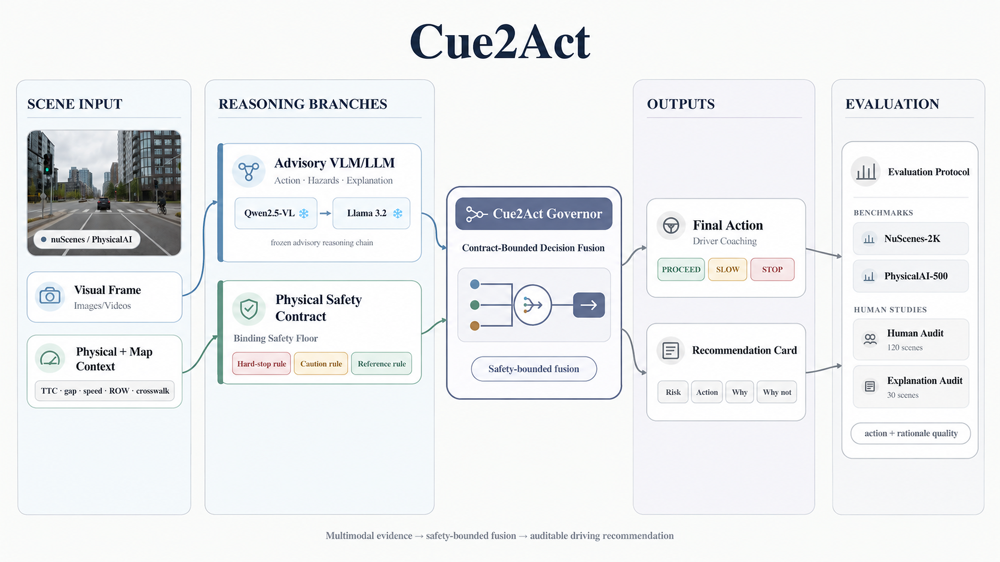
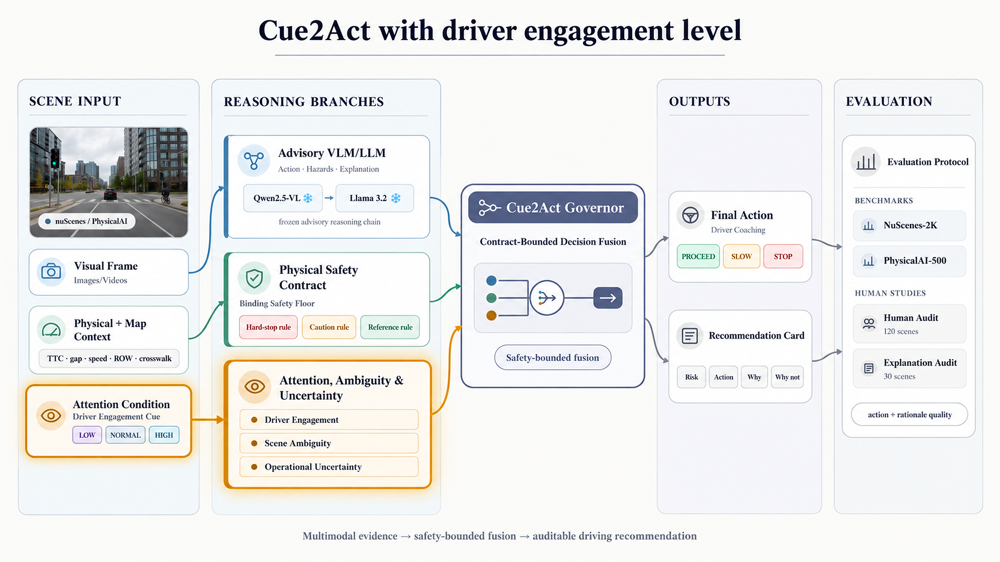
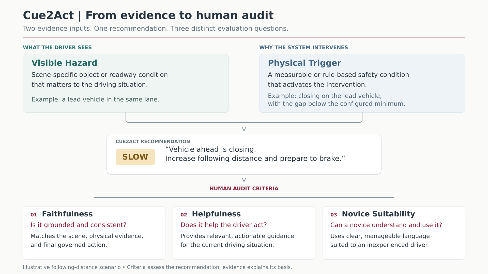

# Trustworthy AI for Transportation Safety

Selected visualizations and demos from my Ph.D. research on AI systems that support transportation decisions while keeping safety evidence interpretable and auditable.

**[Explore the interactive research constellation →](https://elaheyahyapour.github.io/trustworthy-ai-for-safety/)**

Rotate, zoom, search, and browse by chapter: **Perception → Decision-Making → Explanation → Driver-Aware Coaching**

---

## Cue2Act

A driver-coaching framework (not a vehicle controller) that recommends **PROCEED · SLOW · STOP**. The human driver always stays in control.

It combines two sources:

1. **Scene interpretation**: flags roadway hazards and explains them.
2. **Physical safety reasoning**: time-to-collision, gap, speed, right-of-way, crosswalk context.

The **Cue2Act Governor** treats the physical rules as a binding safety floor. The language-model branch advises, but never overrides it.

**Demo:** system recommendations compared across driving scenes

https://github.com/user-attachments/assets/REPLACE_WITH_VIDEO_URL_1

---

## Cue2Act with Driver Engagement

Tests whether coaching should become more conservative under **counterfactual** driver-engagement states (HIGH / NORMAL / LOW). The physical safety boundary never changes.

**Demo:** same scene, three engagement states

https://github.com/user-attachments/assets/REPLACE_WITH_VIDEO_URL_2

This studies policy sensitivity. It does not claim real-time measurement of gaze or attention.

---

## Human Audit

Each recommendation is rated on five criteria: **Visible Hazard**, **Physical Trigger**, **Faithfulness**, **Helpfulness**, and **Novice Suitability**.

---

## Publications

| Study | Paper | Venue |
|---|---|---|
| I. Reliable perception | Fairness-Aware Boosting Model for Imbalanced 3D Point Cloud Segmentation in Autonomous Driving | CVPR Workshops 2025 |
| II. Physics-grounded decisions | Less Is More: Agentic Prompt Design for Safe VLM Action Selection | WACV Workshops 2026 |
| III. Cue2Act | Cue2Act: Contract-Bounded Vision-Language Coaching for Novice Drivers Under Scene Ambiguity and Model Uncertainty | WiML @ NeurIPS 2026 (abstract accepted) |
| IV. Driver engagement | Cue2Act with Driver Engagement: Contract-Bounded Vision-Language Coaching Under Driver Inattention, Scene Ambiguity, and Model Uncertainty | PhysWorldAI @ NeurIPS 2026 (under review) |

---

## Notes

- The studies are conceptually connected but are not one end-to-end deployed system.
- Physical safety rules stay authoritative over advisory model reasoning.
- Driver engagement is counterfactual, not measured from eye-tracking.
- Examples demonstrate the research framework, not production deployment.

---

**Elahe (Ellie) Yahyapour** · Ph.D., Transportation Engineering · University of Massachusetts Amherst
